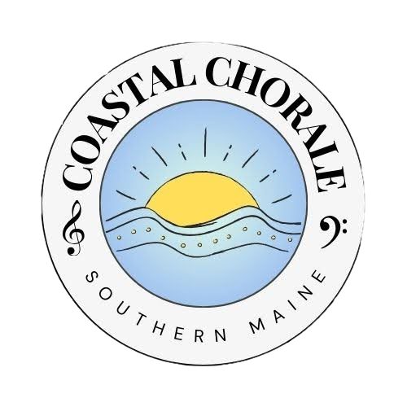

# Coastal Chorale Website




## Getting Started
1) Install dependencies:
```bash
npm install
```
2) Create an `.env.local` in the project root:
```bash
VITE_GOOGLE_API_KEY=your_google_api_key
VITE_CALENDAR_ID=your_public_calendar_id
VITE_GOOGLE_FORM_LINK=your_embedded_form_url
```
3) Run the dev server:
```bash
npm run dev
```
4) Open the URL printed in the terminal (defaults to `http://localhost:5173`).

## Scripts
- `npm run dev` – start the Vite dev server.
- `npm run deploy` – build and publish `dist/` to GitHub Pages.

## Project Structure
- `src/pages/` – page components (Home, About, Program, Photos, Contact).
- `src/components/Navbar.tsx` – site navigation and routing shell.
- `src/assets/` – brand assets and imagery
- `src/lib/googleCalendarApi.ts` – Google Calendar data helper.
- `src/style/` – Sass styles for layout, hero, forms, and program pages.


